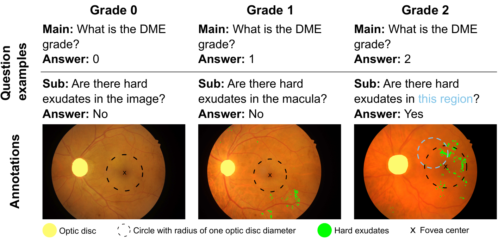

# Consistency-preserving Visual Question Answering in Medical Imaging

## DME VQA Dataset
Here we offer a more detailed description of the [DME dataset](https://zenodo.org/record/6784358). The motivation for this dataset include the lack of public medical VQA datasets with related questions. In our dataset, questions are related because there is a high-level question about the DME grade of the image, and associated low-level questions that can lead to the answer of the high-level question. This allows to study the consistency of a VQA model i.e. how often the model produces contradictory answers to questions about a given image. Questions about regions are also a novel feature of this dataset.

Our dataset was built from the [IDRiD](https://ieee-dataport.org/open-access/indian-diabetic-retinopathy-image-dataset-idrid) and [eOphta](https://www.adcis.net/en/third-party/e-ophtha/) datasets, which are popular datasets with fundus images. The DME VQA dataset contains both healthy and unhealthy fundus images. For each image, a set of pre-defined questions is generated, including questions about regions (e.g. are there hard exudates in this region?), for which an associated mask denotes the location of the region.

The dataset can be used for general VQA purposes, and also for the more specific purpose of consistency improvement.

### Folder structure

This is the folder structure of the dataset:

**📦dme_vqa**\
 ┣ **📂answer_weights**\
 ┃ ┗ *Contains answer weights (computed using ``compute_answer_weights.py``)*\
 ┣ **📂masks**\
 ┃ ┣ *Contains the masks for questions that refer to regions*\
 ┣ **📂processed**\
 ┃ ┣ *Contains processed QA pairs, which includes conversion of sentences to vectors. Also contains vocabs*\
 ┣ **📂qa**\
 ┃ ┣ *Contains original QA pairs*\
 ┗ **📂visual**\
 ┃ ┣ **📂dme_images**\
 ┃ ┃ ┣ *Contains images from the grading task of the IDRiD challenge*\
 ┃ ┣ **📂healthy**\
 ┃ ┃ ┣ *Contains healthy images from IDRiD and eOphta*\
 ┃ ┣ **📂test**\
 ┃ ┃ ┣ *Contains test images*\
 ┃ ┣ **📂train**\
 ┃ ┃ ┣ *Contains train images*\
 ┃ ┣ **📂unhealthy**\
 ┃ ┃ ┣ *Contains unhealthy images from IDRiD and eOphta*\
 ┃ ┗ **📂val**\
 ┃ ┃ ┣ *Contains validation images*\

In the `visual` folder only the subfolders train, val and test are relevant for training. The other folders (dme_images, healthy, unhealthy) correspond to a stage of the dataset creation prior to the division into train-val-test. We include them for completeness.

### Question types

The questions in our dataset were generated automatically from annotations about DME grade and segmentation of hard exudates (if present). There are five types of questions:

- What is the diabetic macular edema grade for this image?
- Are there hard exudates in this image?
- Are there hard exudates in the fovea?
- Are there hard exudates in this region?
- Are there optic discs in this region?

For the last two question types an associated mask is provided in the folder `masks`. The regions were randomly chosen both in size and location. Please notice that in our case the questions about the presence of optic disc do not play any role in the consistency part, because the optic disc is not relevant in the assignment of the DME grade. An exmple of questions from the dataset is presented in the following image:

### Basic information

We present basic information about the dataset, specifically the number of images and QA pairs for each subset.

**Number of images:**

| Subset      | Number of images |
| ----------- | ----------- |
| train      | 433      |
| val   | 112|
| test   | 134        |

**Number of QA pairs:**

| Subset      | Number of QA pairs |
| ----------- | ----------- |
| train      | 9779      |
| val   | 2380|
| test   | 1311        |

As it can be observed from the previous tables, the number of QA pairs is much higher than the number of images. This was possible thanks to the questions about regions. Because the number of possible regions for each image is very high, this allowed us to create many questions for the images with annotations about hard exudates. 

 

This work was carried out at the [AIMI Lab](https://www.artorg.unibe.ch/research/aimi/index_eng.html) of the [ARTORG Center for Biomedical Engineering Research](https://www.artorg.unibe.ch) of the [University of Bern](https://www.unibe.ch/index_eng.html). Please cite this work as:

> @inproceedings{tascon2022consistency,
  title={Consistency-Preserving Visual Question Answering in Medical Imaging},
  author={Tascon-Morales, Sergio and Márquez-Neila, Pablo and Sznitman, Raphael},
  booktitle={International Conference on Medical Image Computing and Computer-Assisted Intervention},
  pages={386--395},
  year={2022},
  organization={Springer}
}
