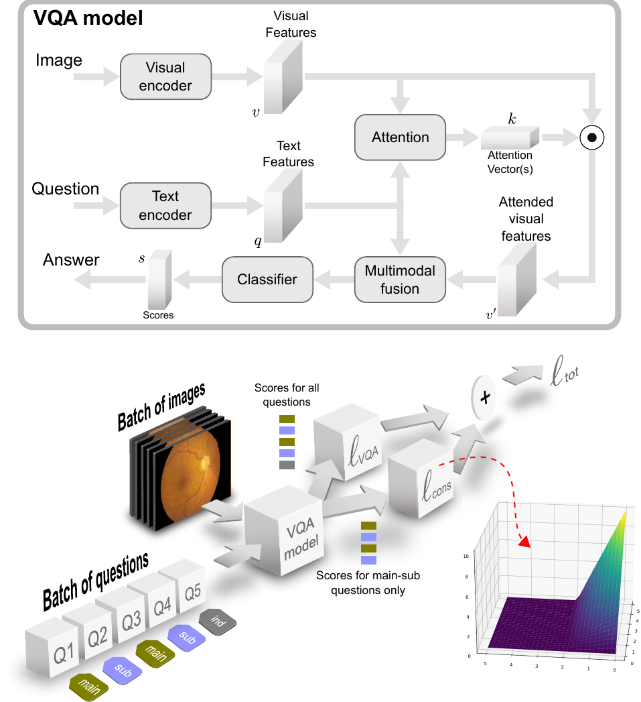

# Consistency-preserving Visual Question Answering in Medical Imaging
This is the official repository of the paper "Consistency-preserving Visual Question Answering in Medical Imaging," published in the proceedings of the MICCAI2022.

Our method consists of a loss function and corresponding training method to improve the consistency. Evaluated on a medical dataset, we achieve improvements both in consistency and accuracy. For more details, please refer to our [paper](/).

## Data
Download our DME dataset from [here](https://drive.google.com/file/d/1qKW6OIL2QdoJ9_xVwaDpfuVBLVnjQr-V/view?usp=sharing). You can place the zip file in any location and then unzip it. We'll refer to the path to the unzipped folder as \<path_data>.

## Configuration file
Open the configuration file from `config/idrid_regions/single/default.yaml` and change the fields `path_img`, `path_qa` and `path_masks` to match the path to the data \<path_data>.

## Training
To train a model just run the following command:

    train.py --path_config <path_config>

## Inference
In order to do inference on the test set, use the following command:

    inference.py --path_config <path_config>

## Plotting metrics and learning curves
To plot learning curves and metrics, use the following command after having trained and done inference:

    plotter.py --path_config <path_config>

This work was carried out at the [AIMI Lab](https://www.artorg.unibe.ch/research/aimi/index_eng.html) of the [ARTORG Center for Biomedical Engineering Research](https://www.artorg.unibe.ch) of the [University of Bern](https://www.unibe.ch/index_eng.html). Please cite this work as:

> citation pending
